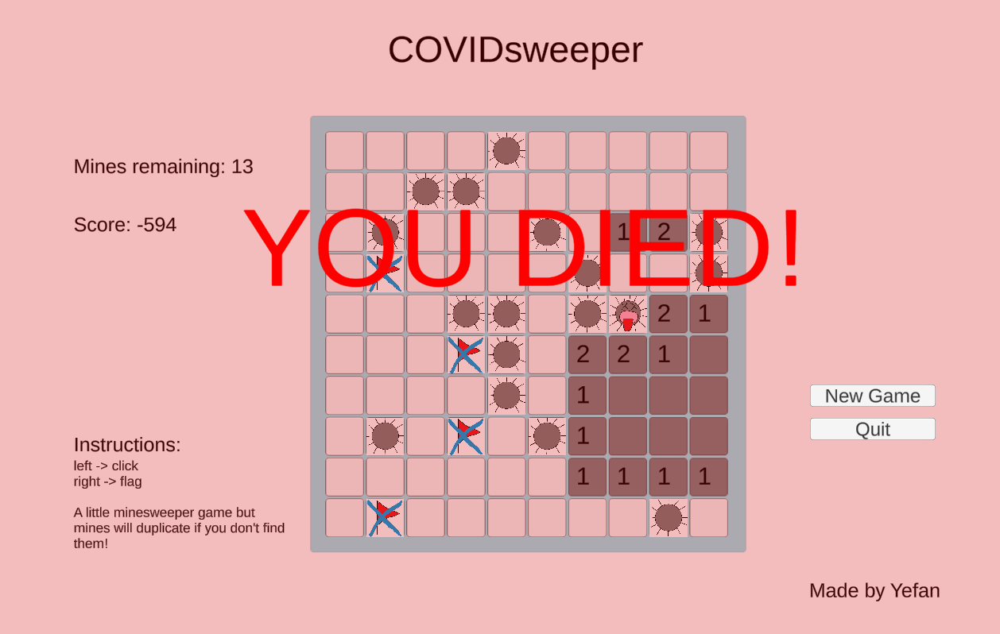

# COVIDsweeper-download
A minesweeper game but the mines will spread to adjacent tiles if you don't find them, just like COVID19! 

Available unity source code at: https://github.com/haohao1331/COVIDsweeper

## Basic Game Mechanics
Left click to open tile and right click to flag, just like classic minesweeper. Mines can only spread to the 8 adjacent tiles
surrounding it. They cannot infect tiles that are adjacent to found numbers, or else that would make those numbers change!

Whether a mine will be generated is updated every 0.5s, with a greater probability if there are more mines remaining. The maximum 
speed which mines will generate is thus 1 per 0.5s. Score is calculated based on the time past and mines generated, along with 
correctly and incorrectly labeled flags and win/lose condition. 

`Score = (int)((600 * 100 / (mineNumber + 5) / (timeCount * 2 + 1)) + correct_labeled * 1.0 - wrong_labeled * 1.0 + (win? 1 : -1) * 800.0)`

where timeCount increments by 1 every 0.5s. 

